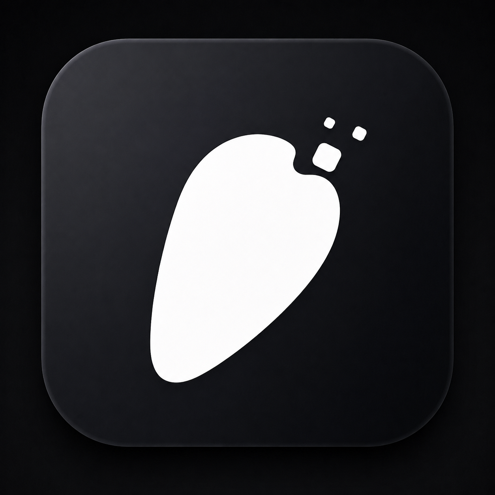

<p align="center">
  
</p>

<h1 align="center">Petra</h1>

<p align="center">一个运行在 Windows 桌面的可自定义 AI 桌宠</p>

<p align="center">
  
  
  
</p>

## 简介

Petra 是一个 Windows 桌面桌宠：一个会漫游、躲避鼠标、视线跟随的动态角色，内置一个可以聊天、调用系统能力、记住用户偏好的 AI 小助手。

核心特点：

- 拖入分层 PSD 即可生成 2.5D 动态角色（本地离线，无需 Cubism Editor）
- 支持标准 Live2D 模型（model3.json）
- 角色、AI 人格、行为、工具均可自定义

## 安装与使用

普通用户无需安装任何开发环境，直接下载使用：

1. 前往 [Releases 页面](https://github.com/Wumiu/Petra/releases)，下载最新的 `Petra_*_x64.zip`
2. 解压，运行其中的 `Petra_*_x64-setup.exe` 完成安装
3. 启动后右键桌宠可打开菜单，调节各项功能
4. （可选）右键 → 小助手设置，填入自己的 AI API Key 即可使用 AI 对话功能；不填写也可以作为普通桌宠使用

## 功能

**角色与模型**

- 拖入分层 PSD，自动装配生成 2.5D 角色（自动眨眼、发丝物理、表情）
- 支持标准 Live2D 模型（model3.json）
- 内置多个角色（deepseek、Elaina ），可在「模型设置」中一键切换
- 右键「模型设置」可导入、切换或删除已导入的 PSD 模型
- 鼠标视线追踪：模型看向鼠标位置（带死区与平滑）

**桌宠行为**

- 桌面漫游，活动频率三档（低 / 中 / 高）
- 鼠标靠近自动躲避
- 逗猫棒模式：追着鼠标跑
- 动作系统：点头、摇头、歪头、挥手、打哈欠、伸懒腰等 14 个动作，按活动频率自动播放
- 待机模式：沉到就近屏幕边缘（上半倒挂 180°），拖动唤醒
- 拖拽互动：按住软乎乎晃动、拖拽惯性摆动、按住眯眼

**桌面能力**

- 拖拽移动桌宠
- 拖文件到桌宠身上 → 送进回收站
- 托盘图标，或 Alt+P 隐藏 / 唤出
- 开机自启
- 检查更新（启动自动检查 + 右键菜单手动检查）

**跟随音乐（未完善）**

- WASAPI 回环捕获系统音频，驱动身体律动、嘴型、眉毛、发丝
- BPM 节拍检测，随节奏摇摆、节拍眨眼

## 自定义角色

内置 Anime2.5DRig 技术（MIT）：**拖入分层 PSD 即自动生成 2.5D 角色**，无需 Cubism Editor、全本地离线运行。
基于Anime2.5DRig技术实现一键live2d效果，可自定义角色形象。

**推荐流程**

准备一张想要的角色正面视图，前往 https://huggingface.co/spaces/24yearsold/see-through-demo 一键拆分成psd，体验次数有限，也可以本地部署其see-through拆分。
再前往https://852wa.github.io/Anime2.5DRig/ 导入生成的psd看看效果，若有缺陷，则需使用软件修改图层（在线编辑网站：https://www.photopea.com/）
若效果不错，则可直接导入桌宠中替换。

**换模型**

1. **拖入 PSD**：把分层 PSD 文件直接拖到桌宠身上 → 自动装配并即时换皮（存应用数据目录，持久化）
2. **右键菜单 → 模型设置**：「＋ 导入 PSD 模型」选择文件，也可在此面板切换内置 / 已导入模型
3. **打包默认模型**：PSD 放 `public/models/`，编辑 `public/models/manifest.json`：

```json
{ "type": "psd", "file": "deepseek.psd", "files": ["deepseek.psd", "Elaina.psd"] }
```
- `file`：默认加载的模型
- `files`：所有内置模型列表，用户可在「模型设置」中切换

标准 Live2D 模型（model3.json）仍支持，manifest 改为 `{ "active": "model" }`。使用标准 Live2D 模式需先放入官方 Cubism Core runtime（`live2dcubismcore.min.js`，Live2D 官网下载，见其许可）到 `public/vendor/`，并在 `index.html` 的 `<head>` 中以 `<script>` 引入。

**PSD 图层命名规范（Anime2.5DRig 约定）**

| 图层名 | 内容 | 说明 |
|---|---|---|
| `face` | 脸基 | 锚点基准，最好有 |
| `eyewhite` | 白目（左右同层） | 自动左右分离 |
| `irides` | 虹膜 | 视线 / 瞳缩放，白目内裁剪 |
| `eyelash` | 开眼睫毛 | |
| `eye_close` | 闭眼 | 缺省自动生成 |
| `eyebrow` | 眉毛 | 角度 / 上下可操作 |
| `mouth_open` | 开口 | 开度驱动 |
| `mouth_close` | 闭口 | 缺省自动生成 |
| `nose` / `ears` / `neck` / `topwear` / `bottomwear` / `handwear` / `headwear` | 五官 / 躯体 | |
| `front hair` / `back hair` | 前 / 后发 | 自动发丝物理；可分 `front hair_1`、`_2`… |

- 不符合命名规则的图层也会自动按位置归类（头部 / 躯体），仅跟随
- 图层需**扁平**（不支持图层组）；画布建议正方形 768~2048
- 完整规范见上游 [Anime2.5DRig README](https://github.com/852wa/Anime2.5DRig)

## AI 小助手

小助手不只聊天，还具备桌面环境中的部分系统能力：

- **流式对话**：点击桌宠弹出输入框，回复逐字输出
- **软件启动**：说「打开网易云」等，调用 `launch_application` 按应用名解析并启动（别名 + 开始菜单快捷方式 + ShellExecute），不依赖 AI 猜路径
- **Shell 能力**：必要时调用 `run_shell`，执行前弹出确认气泡（可勾选「免确认 shell」），危险命令与链式命令（`& | > <`）一律拦截，15 秒超时终止
- **长期记忆**：AI 自动归档用户偏好，也可说「记住 xx」
- **主动问候**：每 20 分钟识别当前前台窗口，结合上下文自然打招呼
- **人格设定**：右键 → 小助手设置 →「人格设定」

**AI 配置**

| 项 | 说明 |
|---|---|
| 提供商 | DeepSeek（内置）/ 自定义（OpenAI Compatible） |
| API Key | DPAPI 加密存储于应用数据目录，不明文落盘 |
| API 端点 | 自定义模式下填写 Base URL，如 `https://your-api.example.com/v1` |
| 模型名 | 可点「自动获取模型」拉取端点支持的模型列表 |

## 开发者运行

> 普通用户请直接去 [Releases](https://github.com/Wumiu/Petra/releases) 下载安装包，无需源码。

环境要求：Windows 10/11、Node.js 18+、Rust（stable）、WebView2 Runtime。

```bash
git clone https://github.com/Wumiu/Petra.git
cd pet
npm install
npm run tauri dev      # 开发
npm run tauri build    # 打包
```

## 项目结构

```
src/                        # 前端（Vite + TypeScript + Pixi.js）
├─ live2d/                  # 渲染层：PSD 运行时 / 标准 Live2D 后端 / 驱动映射
│  └─ psd/                  # Anime2.5DRig 运行时（GL 网格 / 变形 / 物理 / 裁剪）
├─ autonomous/              # 行为系统（漫游 / 追踪 / 待机 / 活动频率）
├─ assistant/               # AI 小助手（流式对话 / 工具调用 / 记忆 / 主动问候）
├─ audio/                   # 音频分析（音乐驱动动画）
├─ features/trash/          # 拖拽进回收站
├─ bridges/                 # Astrobot 外部指令桥接
└─ ui/ utils/               # 菜单 / 提示 / 工具函数

src-tauri/                  # 后端（Tauri 2 + Rust）
├─ src/
│  ├─ lib.rs                # 命令注册 / Shell 校验 / 反馈 / DPAPI
│  ├─ launch.rs             # 应用名解析与启动
│  ├─ screen.rs             # 窗口 / 光标 / 工作区
│  ├─ audio.rs              # WASAPI 回环捕获
│  └─ trash.rs              # 回收站操作
├─ icons/                   # 应用与托盘图标
└─ tauri.conf.json          # 窗口 / 打包配置

scripts/                    # 辅助脚本
public/models/              # 默认角色资源 + manifest.json
```

## 诊断

- 前端报错与启动埋点汇集到 `%APPDATA%\com.wumiu.petra\logs\pet.log`
- dev 构建自带 WebView2 远程调试端口 9222，`node scripts/cdp-diag.mjs` 可抓取页面异常详情
- 排查启动问题先看 `pet.log`：`boot:start → boot:view=<类型> → boot:loop=start → boot:audio=on`

**Astrobot 预留接口**

外部进程可通过 `src/bridges/astrobot.ts` 向桌宠派发指令：

```js
window.__ASTROBOT__.emit({ type: "speak" | "emote" | "gesture" | "move" | "react", payload: {} })
```

指令会触发对应反馈动画（speak → 吞咽、emote/gesture → 点击反应、move → 随机传送）。

## 开源许可与致谢

本项目基于 [MIT License](LICENSE) 开源。

内置并借鉴了以下开源项目，特此致谢：

- **Anime2.5DRig**（自动 PSD 装配 / 2.5D 运行时，内置 `src/vendor/anime2dr/`）：MIT License，作者 [852wa (hakoniwa)](https://github.com/852wa)，源码 <https://github.com/852wa/Anime2.5DRig>。许可证全文见 `src/vendor/anime2dr/LICENSE`。
- **See-through**（单图拆分层层 PSD 的技术方案与在线 Demo）：学术项目 [shitagaki-lab/see-through](https://github.com/shitagaki-lab/see-through)，在线 Demo <https://huggingface.co/spaces/24yearsold/see-through-demo>（大陆用户也可用魔搭 ModelScope 版本）。
- **ag-psd**（PSD 解析）：MIT License。

## 免责声明

- 本软件与 Live2D 株式会社**无任何关联、授权或背书**；「Live2D」为 Live2D 株式会社的注册商标，此处仅用于说明本软件兼容其模型文件格式。
- 使用 See-through / Photopea 等工具处理图片时，请仅使用**自己拥有版权或已获得授权**的图片；因图片版权产生的纠纷与作者无关。
- 第三方链接仅为便利提供，作者不对第三方服务的内容与可用性负责。

## 隐私说明

- 主动问候会读取**当前前台窗口标题 + 进程名**并发送给 AI 判断，标题可能包含文件名、聊天内容等敏感信息；介意可关闭小助手模式
- API Key 经 Windows DPAPI 加密存储于应用数据目录，不明文落盘