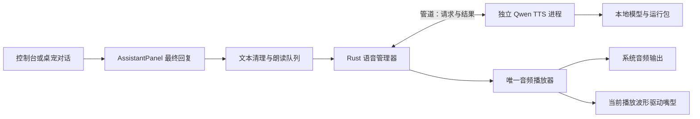

> 历史研究记录：2026-09-17 已按用户要求移除 TTS 功能。下述方案与语音包不再属于当前实现或构建要求。

# Qwen3-TTS 本地语音内置研究

> 历史方案：用户已于 2026-09-16 取消 Qwen 选型。当前实现采用 sherpa-onnx + Kokoro v1.1 中文/英文 INT8，见 [本地语音内置方案](本地语音内置方案.md)。以下保留调研记录，不作为当前开发计划。

研究日期：2026-09-16。范围为 MollyCloud Windows 桌面端的本地语音合成方案；本轮完成上游资料、源码、模型清单和现有应用接入点核对，尚未下载模型权重或进行语音推理，因此性能指标均需下一步实测。

## 结论

可以将 `Qwen/Qwen3-TTS-12Hz-0.6B-CustomVoice` 集成到软件。推荐首版采用 **Rust 管理的独立语音进程 + 官方 qwen-tts/PyTorch + 可下载语音资源包**。用户在 Molly 设置中安装、选择音色和开启朗读，无需自行安装 Python、启动服务或填写语音 API Key；语音包安装完成后可离线合成。现有助手聊天仍使用原来选择的供应商。

补充选型：上面的推荐以保留指定 Qwen 模型为前提。若更看重轻量、CPU 运行和安装便利，并接受更换音色模型，优先验证 **sherpa-onnx + Kokoro v1.1 中文/英文 INT8**，详见文末补充。

该模型属于 Qwen3-TTS 系列的小规格，但完整原始模型约 2.50GB，再加运行库，不能按几十 MB 的轻量组件设计。默认安装包宜保留下载管理器和调用桥接；同时预留包含模型与运行库的离线资源包。首版优先支持 NVIDIA GPU，CPU 作为待性能验证的兼容方式，不承诺实时朗读。

## 模型与能力核对

用户提供的链接为 [1.7B-Base](https://modelscope.cn/models/Qwen/Qwen3-TTS-12Hz-1.7B-Base)。本方案按用户明确指定的 [0.6B-CustomVoice](https://modelscope.cn/models/Qwen/Qwen3-TTS-12Hz-0.6B-CustomVoice) 制定，两者不能混用。

| 项目 | 核对结果 |
| --- | --- |
| 定位 | 预设音色文字转语音；Base 才是参考音频克隆路线 |
| 语言 | 中文、英语、日语、韩语、德语、法语、俄语、葡萄牙语、西班牙语、意大利语 |
| 音色 | Vivian、Serena、Uncle_Fu、Dylan、Eric、Ryan、Aiden、Ono_Anna、Sohee，共 9 种 |
| Molly 初始音色建议 | Serena：温柔年轻女声；Vivian：明亮年轻女声。最终以中文试听选择 |
| 情绪/风格指令 | 0.6B 不支持；官方推理代码会把 `instruct` 清空。需要此能力时再评估 1.7B-CustomVoice |
| 声音设计/任意音色克隆 | 不属于本次 CustomVoice 模型的功能 |
| 输出 | 24kHz 音频；12Hz 是语音编码规格，不是播放采样率 |
| 许可 | 官方代码与目标模型标注 Apache-2.0；随资源包保留许可证和第三方声明 |

目标模型卡的简介和示例写有指令控制，但与官方总览能力表和实际源码不一致。本方案以源码中的 `tts_model_size == 0b6` 对应行为为准，不在设置中放置无效的“开心/生气”等指令选项。

同样需要区分模型架构支持流式生成与 Python 高层 API 实际返回方式。当前 `generate_custom_voice()` 先完成生成，再统一解码并返回整段波形；其 `non_streaming_mode=False` 注释明确说明只是模拟流式文本输入，不能直接提供真正的流式音频。官方宣传的最低 97ms 不能作为本机首音延迟承诺。

## 文件体积与本机条件

通过 ModelScope 文件 API 和 Hugging Face 文件元数据交叉核对，仅读取元数据，没有下载权重：

| 文件 | 字节数 | 十进制体积 |
| --- | ---: | ---: |
| `model.safetensors` | 1,811,626,576 | 1.812GB |
| `speech_tokenizer/model.safetensors` | 682,293,092 | 0.682GB |
| ModelScope 仓库全部文件 | 2,498,389,167 | 2.498GB，约 2.327GiB |

完整 CustomVoice 仓库已包含 `speech_tokenizer/`；按这个目录布局安装时无需再重复下载一份独立 Tokenizer。运行包还需 Python、PyTorch/CUDA、音频和推理依赖；最终下载大小与解压占用需在依赖锁定、裁剪和干净机器打包后统计，不能把 2.50GB 当作整个功能大小。

本机实测硬件：RTX 3070 Ti，8,192MiB 显存；约 31.8GiB 系统内存。查询时可用显存约 6,102MiB，会随其他软件变化。该配置适合优先验证 GPU 方案，但模型文件大小不等于推理峰值显存，仍需测试与 Live2D、浏览器和其他 GPU 软件并行运行的情况。

## 运行方案比较

| 路线 | 已确认支持情况 | 成本与限制 | 建议 |
| --- | --- | --- | --- |
| 官方 qwen-tts + PyTorch 独立进程 | 直接支持目标 CustomVoice、9 音色和中文 | Windows 需固定依赖并封装 Python/CUDA；体积较大 | 首版参考实现，先建立音质和性能基线 |
| ONNX Runtime + 独立进程 | `ElBruno.QwenTTS` 提供目标 0.6B-CustomVoice 导出与 C# 实现 | 当前导出仓库约 5.883GB；含独立 prefill/decode 权重等，不能假定更小。DirectML 路线将声码器放在 CPU | 第二阶段跨显卡/去 Python 候选，需实测和裁剪 |
| GGML/GGUF C++ | 所检查 `predict-woo/qwen3-tts.cpp` 文档以 0.6B-Base 和参考音频为主 | 未核实该项目的 CustomVoice 音色兼容性；不能直接替换指定模型 | 暂不作为首版依赖 |
| C++ ONNX 示例 | 所检查 `leaxer-qwen3-tts` 将 CustomVoice 预设音色列为 Planned | 不能据其支持 Base 推断支持本需求 | 暂不采用 |

量化是后续选项：先用未量化结果作参照，再测 FP16/INT8 等导出或量化路线的中文读音、停顿、数字与显存占用。Qwen3-TTS 包含 talker、code predictor 和音频解码等环节，不能当作普通聊天 GGUF 直接交给现有 LLM 运行器。

Windows 首版建议用 CUDA + BF16/FP16，并优先 `attn_implementation="sdpa"`。已核实官方模型代码声明支持 SDPA。FlashAttention 项目仍提示 Windows 编译需要更多测试，因此不把它作为用户安装前提。需将测试通过的 Python、PyTorch、torchaudio、transformers、accelerate 等版本一起锁定，而非在用户机器运行 `pip install -U`。

## MollyCloud 接入设计

### 对话与播放

现有入口是 `app/src/petra/assistant/AssistantPanel.ts` 的 `send()` / `submitAssistantMessage()`。它处理控制台与桌宠共用的消息、流式文字及工具调用循环。

首版在确认没有后续工具调用的最终回复处提交朗读任务，按句号、问号等分句，第一句合成完成后播放，同时准备下一句。这样提供连续的分句播放，不把高层 API 描述为真正的 token 级流式 TTS。不要直接朗读所有 `onToken` 回调：当前代码可能继续执行工具并清空中间文字，会产生重复或错误播报。代码块、Markdown 标记、裸 URL 和工具参数应在送入朗读前清理。

每次回复生成 `messageId`，每段携带 `utteranceId` 和顺序号；全应用仅有一个播放队列，防止控制台和桌宠双重播报。初期同一时间仅运行一个合成请求。用户发送新消息、点击停止或关闭朗读时，立刻清空播放队列并停止当前音频；后台任务也取消，过期结果按 ID 丢弃。同步推理不能中途安全退出时，由进程管理器终止工作进程并在下一次请求重建；不能仅把界面设为空闲却让旧声音继续播放。

### 进程、文件与权限

新增 Rust `tts` 模块管理 worker 生命周期、模型状态、设备选择和任务队列。worker 只在首次朗读/试听时加载模型，可配置空闲卸载；初始化失败不影响文字聊天。Windows 子进程隐藏控制台窗口，并跟随主程序退出，避免遗留占用显存的进程。

建议使用匿名管道或命名管道，无需开放本地 HTTP 端口。IPC 限定为版本化的 `status`、`load`、`synthesize`、`cancel`、`unload` 消息；结果包含采样率、音频长度和本次任务的音频数据/文件标识。不能暴露任意 Python 执行或任意文件读取。前端通过 Rust 的专用命令访问，保持生图 sandbox 和 CC Switch 的现有边界。

模型和运行包保存在 MollyCloud 的 `app_data_dir()/tts/` 下，按模型修订和运行包版本分目录；临时音频放 `app_cache_dir()/tts/`，退出/到期清理。安装到临时目录并按清单校验 SHA-256，全部通过后原子切换当前版本；支持取消、续传、磁盘空间检查和卸载资源包。使用固定来源与修订，加载已安装的本地目录并关闭隐式联网下载；普通用户不需要全局 Python、CUDA 开发工具或命令行安装环境。

短句原型可经受限 IPC 返回 WAV 字节，由 `AudioContext.decodeAudioData()` 播放；如果后续改为临时文件播放，只开放专用音频协议或受限缓存读取命令。当前 Tauri asset scope 仅允许 `$RESOURCE/**`，不能通过放开整个用户目录来播放缓存文件。音频 PCM 应分块传输，避免将长段浮点数组频繁广播成 JSON。

### 嘴型与现有音频动画

现有 `AudioAnalyzer.ts` 分析 Rust WASAPI 的整机回环音频，`main.ts` 将中频等值写入 `PetDriver`，Live2D/PSD 模型据此改变嘴型。这是环境音频联动，不是专门的 TTS 口型通道。

新增独立的朗读音量包络，如 `PetDriver.speechMouthOpen`，从实际播放中的 TTS PCM 计算并做平滑，单独驱动嘴巴；停止/暂停时归零。不要借助整机回环驱动朗读口型，否则音乐和通知声会干扰，而且关闭现有“音频联动”后嘴型也会失效。嘴型可分第二步接入，但播放器与包络数据通路应在首版设计好。

### 设置与打包

设置里增加“本地语音”区域：安装/删除语音包、启用朗读、音色、试听、音量、设备选择和模型释放策略。默认推荐 Serena；第一版不显示该模型不支持的情绪指令。语速若通过播放器调整，会影响音调；若要求保持音调，应另做时间伸缩并单独验证，不能假设 `instruct` 能控制 0.6B 语速。

UI 沿用 `design-system/molly-desktop/MASTER.md`、共享 token 和主题；真正修改设置 UI 时执行既有登录及七页回归。TTS 开关与现有 `audioEnabled` 分开，现有开关管理音乐/系统声音联动。

开发时可用隔离环境建立基线；交付时封装并签名独立 worker 与运行资源包，用户不手动配置环境。每个包记录模型、运行库版本、平台/架构和校验值；主程序升级不重复下载未变更模型。默认提供在线按需资源包，若需要首次启动完全断网可用，再提供带相同资源包的离线发行版。

## 实施顺序与验收

1. **独立验证**：在隔离目录安装官方依赖并下载目标模型，以 Serena/Vivian 合成中文短句、中英混读、数字/金额、较长段落；记录冷加载、首句等待、总合成时间、音频时长、峰值显存/内存。对比 SDPA/BF16 与 FP16，保留音频试听和依赖锁文件。
2. **最小集成**：Rust worker 管理、资源包安装、专用 IPC、单一队列、最终回复分句播放、停止和过期结果丢弃。用本地合成回复测试，不依赖付费模型调用。
3. **桌宠体验与发行**：独立嘴型包络、设置 UI、空闲卸载、进程崩溃恢复、离线包与干净 Windows 机器验收。模型与运行库资源未准备完整前不标记功能“可用”。
4. **性能优化**：根据基线决定是否投入真正的音频流式输出，或迁移经验证的 ONNX/量化 worker，保持上层 IPC 与播放器兼容。

建议以 `RTF = 合成耗时 / 音频时长` 记录速度；持续朗读需要热启动 RTF 小于 1，留有队列和 Live2D 同时运行的余量。首句延迟、取消响应和冷启动分别统计，不用平均值掩盖首句等待。本机能否达到这些目标尚未实测。

测试需覆盖断网加载、下载中断、损坏模型、磁盘不足、显存不足、无 NVIDIA GPU、中文/空格目录、控制台与桌宠同时显示、停止后无旧音频、重复事件不重复播报、关闭软件无残留进程。生产包体积以实际构建清单为准。

## 来源与可复核记录

- [官方仓库与能力表](https://github.com/QwenLM/Qwen3-TTS)，本次源码修订 `022e286b98fbec7e1e916cb940cdf532cd9f488e`。
- [官方推理封装：0.6B instruct 与流式限制](https://github.com/QwenLM/Qwen3-TTS/blob/022e286b98fbec7e1e916cb940cdf532cd9f488e/qwen_tts/inference/qwen3_tts_model.py)。
- [目标模型 ModelScope 页面](https://modelscope.cn/models/Qwen/Qwen3-TTS-12Hz-0.6B-CustomVoice) 与 [文件 API](https://modelscope.cn/api/v1/models/Qwen/Qwen3-TTS-12Hz-0.6B-CustomVoice/repo/files?Revision=master&Recursive=true)。
- [目标模型 Hugging Face 页面](https://huggingface.co/Qwen/Qwen3-TTS-12Hz-0.6B-CustomVoice)，本次修订 `85e237c12c027371202489a0ec509ded67b5e4b5`。
- [FlashAttention 平台说明](https://github.com/Dao-AILab/flash-attention#installation-and-features)。
- [ElBruno.QwenTTS](https://github.com/elbruno/ElBruno.QwenTTS)、[DirectML/CUDA 说明](https://github.com/elbruno/ElBruno.QwenTTS/blob/main/docs/gpu-acceleration.md)、[0.6B CustomVoice ONNX 权重](https://huggingface.co/elbruno/Qwen3-TTS-12Hz-0.6B-CustomVoice-ONNX)。
- [所检查的 GGML 实现](https://github.com/predict-woo/qwen3-tts.cpp) 与 [C++ ONNX 实现](https://github.com/leaxer-ai/leaxer-qwen3-tts)。

资料快照、访问地址、模型元数据及校验清单保存在 `artifacts/tts-research/`。社区项目的能力来自其文档和文件清单，本轮未执行或验证这些项目的推理代码。

## 补充：sherpa-onnx 的适用性

2026-09-16 核对 [sherpa-onnx](https://github.com/k2-fsa/sherpa-onnx)，最新发布为 v1.13.8（2026-09-10）；所读主分支修订为 `7c4ccdff34a3a8e858d834c0793f3512d25b4241`。

它是语音推理引擎，需配合其已支持的 TTS 模型。当前 `OfflineTtsModelConfig` 包含 VITS、Matcha、Kokoro、ZipVoice、Kitten、Pocket、Supertonic，未包含 Qwen3-TTS；完整仓库文件列表中出现的 Qwen3 是 ASR 语音识别，不能据此推断支持 Qwen3-TTS。将任意模型导出为 ONNX 也不会自动获得 sherpa 的分词、音色、生成与解码支持。

对于 Molly 的轻量本地朗读需求，它比当前 Qwen/PyTorch 路线更值得优先验证：已提供 Windows x64 原生库、官方 Rust API、中文 TTS 示例和 CPU 运行方式，运行端无需 Python 或 PyTorch。可直接放入 Tauri 后端的专用工作线程；若需要隔离原生库崩溃，则封装成小型 Rust worker 进程，继续复用前述 IPC、播放器和嘴型通道。

| 语音模型 | 官方下载资产大小 | 适用性 |
| --- | ---: | --- |
| `kokoro-int8-multi-lang-v1_1.tar.bz2` | 147,031,220 字节，约 147.03MB | 首选验证；中英双语，103 音色可选，含多种中文女声 |
| `kokoro-multi-lang-v1_1.tar.bz2` | 364,816,464 字节，约 364.82MB | 未量化对照版本，用于比较 INT8 音质 |
| `vits-melo-tts-zh_en.tar.bz2` | 167,006,755 字节，约 167.01MB | 单音色、中英双语候选；官方提示英文词需在词典中，专有名词需补词 |
| `matcha-icefall-zh-baker.tar.bz2` | 75,463,442 字节，另需约 53.88MB vocoder | 中文单女声；官方文档明确提示其训练数据仅非商业使用，不作为 Molly 默认分发候选 |

以上是压缩下载包大小，不是解压占用或运行内存；此前 Qwen 2.50GB 是原始仓库文件总量，两者不是相同压缩口径。sherpa v1.13.8 的 Windows x64 shared MT Release 完整发布包为 24,805,859 字节，不含语音模型；最终软件增量还需按实际选择的库、字典和声音包构建统计。

Kokoro v1.1 的上游模型卡标注 Apache-2.0，sherpa 引擎代码也为 Apache-2.0；打包时仍分别保留模型、原生库及语音前端依赖的许可证，不能用引擎许可证代替所有资源的条款。

集成建议：

1. 用固定版本的官方 Rust wrapper/native 库，先选 CPU、2 个推理线程和单实例串行队列；在后台线程加载并复用模型，避免阻塞 UI。
2. 使用 `GenerationConfig` 的音色 ID 与 `speed`，支持中文女声试听；不映射 Qwen 的 Serena/Vivian 名称，Kokoro 有自己的音色表。
3. `generate_with_config()` 提供音频/进度回调，并允许返回 false 提前停止，可接入播放队列与取消标记。回调粒度取决于具体模型，仍需分句与首句延迟测试，不能承诺逐 token 即时出声。
4. 保留“最终回复分句朗读、全应用一个播放器、过期结果丢弃、独立嘴型包络”的设计。语音资源可以随安装包附带，也可首次启用时下载。
5. 先对 Kokoro INT8 与未量化版试听并测 CPU 首句延迟、RTF、峰值内存；使用金额、日期、多音字、Molly/Codex 等名称和中英混读作为样本。若满足体验目标，再决定是否需要额外保留 Qwen 高资源方案。

本轮为资料和接口核对，没有下载语音包或执行 sherpa 合成，音质与本机性能尚未实测。

补充来源：

- [支持的 TTS 配置源码](https://github.com/k2-fsa/sherpa-onnx/blob/7c4ccdff34a3a8e858d834c0793f3512d25b4241/sherpa-onnx/csrc/offline-tts-model-config.h)。
- [官方 Rust 中文/英文 Kokoro 示例](https://github.com/k2-fsa/sherpa-onnx/blob/7c4ccdff34a3a8e858d834c0793f3512d25b4241/rust-api-examples/examples/kokoro_tts_zh_en.rs) 和 [Rust TTS 接口](https://github.com/k2-fsa/sherpa-onnx/blob/7c4ccdff34a3a8e858d834c0793f3512d25b4241/sherpa-onnx/rust/sherpa-onnx/src/tts.rs)。
- [Kokoro 模型说明](https://k2-fsa.github.io/sherpa/onnx/tts/pretrained_models/kokoro.html)、[模型下载资产](https://github.com/k2-fsa/sherpa-onnx/releases/tag/tts-models)、[Windows 运行库资产](https://github.com/k2-fsa/sherpa-onnx/releases/tag/v1.13.8)。
- [Kokoro v1.1 中文上游模型卡](https://huggingface.co/hexgrad/Kokoro-82M-v1.1-zh)、[Melo 词典限制](https://k2-fsa.github.io/sherpa/onnx/tts/pretrained_models/vits.html#vits-melo-tts-zh-en-chinese-english-1-speaker)、[Matcha 中文数据许可说明](https://k2-fsa.github.io/sherpa/onnx/tts/pretrained_models/matcha.html#matcha-icefall-zh-baker-chinese-1-female-speaker)。

补充资料快照位于 `artifacts/tts-research/sherpa-onnx/`。
